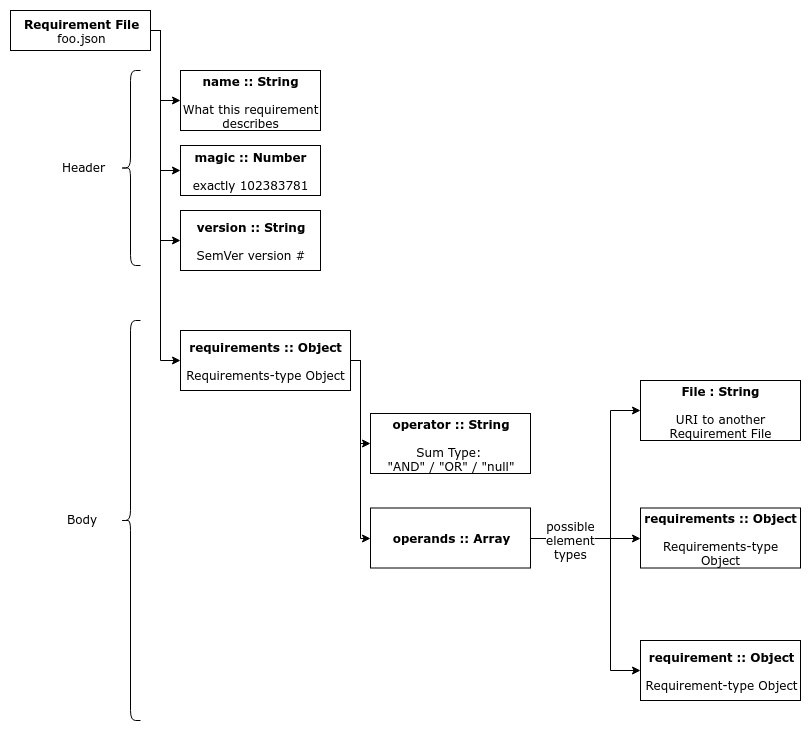

# Graduation Requirements Specification Language (GRADSPEC)

## Description
An attempt to describe graduation requirements in a standard format for courses in the National University of Singapore.

## Project Status
WORK IN PROGRESS. Not able to describe MCs moving between sections due to certain conditional requirements: see CS 2015/16 Cohort. 

## Current Version
Current version number is **0.2.0**

## Format
Files are expected to be in the **JSON** format. 

## Syntax & Semantics
This section describes the different types of entities within the overall requirements description. 


### Overall Structure



Concrete example, with the `requirements` section being truncated for now:

```javascript
{
    "name": "NUS Computer Science Cohort 2015/16",
    "magic": 102383781,
    "version": "0.2.0",
    "requirements": ...
}
```

### Header
An overall header for the JSON object that is describing a set of graduation requirements.

Fields that **must** be present:
1. **name**: The course that this object is decribing. E.g. "NUS Computer Science Cohort 2015/16 Graduation Requirements"
2. **magic**: A magic number that indicates to any JSON parsers that this is a valid file of this type. Must be exactly **102383781**. The number has no significance.
3. **version**: A SemVer version number for future compatibility. Earliest version is 0.1.0.

### Body (Requirements)
The body section of the JSON object describes the actual course graduation requirements. 

Fields that must be present:
1. **requirements**: A **Requirements** object (refer to section on Requirements below).

## Requirements Field Syntax & Semantics

### Requirements Object Type
This is a **collection of Requirement/Requirements** objects that are semantically linked with **AND/OR/null logical operators**. 

Fields that must be present:
1. **operator**: String that can only take on the values (case-sensitive) "AND"/"OR"/"null"
2. **operands**: A Javascript array that can have values with one of three different types
    - **Requirement** object: explained further down - this is the core type that describes the modules that need to be taken.
    - **File** string: A path to another GRADSPEC file 
    - **Requirements** object: Another set of operator and operands.

**Requirement** objects can be combined by **AND** combinators or **OR** combinators just like any normal boolean expression. If neither are necessary, the `null` combinator can be used, but the operand list must only have at most 1 requirement.

For example, if we have **Requirement** objects `r1`, `r2` and `r3`, we could have a **Requirements** expression be equal to (`r1` AND `r2`) OR `r3`. To satisfy this set of requirements, either `r1` and `r2` both have to be fulfilled, or just `r3` needs to be fulfilled. 


**Requirements** expressions are written as such (e.g. assuming some  **Requirement** objects r1, r2 and r3 exist):

```javascript
{
    "name": "NUS Bachelor of Computing, Computer Science, Cohort 2015/16",
    "magic": 102383781,
    "version": "0.1.0",
    "requirements": 
        { 
            "operator": "or", 
            "operands": [
                {
                    "operator": "and", 
                    "operands": [r1, r2]
                }, 
                r3]
        }
}
```
This describes the requirement: `(r1 AND r2) OR r3`


### Requirement
This is a particular number/combination of module requirements.

Fields that must be present for all subtypes:
1. **title**: The title of this requirement, e.g. "Computer Systems Team Project"
2. **req-type**: The subtype of requirement this is

There may be other fields depending on **req-type**.

There are many sub-types of Requirement that cater to different kinds of module requirements. Therefore the type "Requirement" is abstract and only concrete implementations below can be used.

#### Requirement Subtype: Take all modules from module list
A simple list of modules that must **all** be completed to satify this requirement.

Fields:
1. **req-type**: "take-all"
2. **modules**: \<list of modules\>

e.g. 

```javascript
{
    "title": "Computer Systems Team Project",
    "req-type": "take-all",
    "modules": [...]
}
```

#### Requirement Subtype: Take n modules from module list
Some number of modules from a given list must be taken to satify this requirement

Fields:
1. **req-type**: "take-n"
2. **n**: \<# of modules to take\>
3. **modules**: \<list of modules\>

Note: if you want to indicate only one module needs to be taken from a list - set `n` = 1. 

```javascript
{
    "title": "Computer Systems Team Project",
    "req-type": "take-n",
    "n": 5,
    "modules": [...]
}
```

#### Requirement Subtype: Take n modules over (non-inclusive) Level x from a list
Some number of modules that are over a particular module level (e.g. 5 modules over level-3000) must be taken to satify this requirement

Fields:
1. **req-type**: "take-n-above-level"
2. **n**: \<# of modules to take\>
3. **level**: The module level restriction  (e.g. 2000)
4. **modules**: \<list of modules\>

```javascript
{
    "title": "Computer Systems Team Project",
    "req-type": "take-n-above-level",
    "n": 5,
    "level": 3000,
    "modules": [...]
}
```

#### Requirement Subtype: Take n modules below (non-inclusive) Level x from a list
Some number of modules that are below a particular module level (e.g. 5 modules below level-2000) must be taken to satify this requirement

Fields:
1. **req-type**: "take-n-below-level"
2. **n**: \<# of modules to take\>
3. **level**: The module level restriction  (e.g. 2000)
4. **modules**: \<list of modules\>

```javascript
{
    "title": "Computer Systems Team Project",
    "req-type": "take-n-below-level",
    "n": 5,
    "level": 2000,
    "modules": [...]
}
```

#### Requirement Subtype: Take n modules matching general regex from a list
Some n modules that match a particular regular expression must be taken to satify this requirement

Fields:
1. **req-type**: "take-n-regex"
2. **n**: \<# of modules to take\>
3. **regex**: The regex to check for matches with on each module
4. **modules**: \<list of modules\>

```javascript
{
    "title": "Computer Systems Team Project",
    "req-type": "take-n-regex",
    "n": 5,
    "regex": "CS[0-6]{4}",
    "modules": [...]
}
```

#### Requirement Subtype: Take some number of modules with total MCs > n, modules matching general regex from a list
Some modules that have an MC load that exceeds n  that all match a particular regular expression must be taken to satify this requirement

Fields:
1. **req-type**: "take-mcs-regex"
2. **mcs**: \<# of MCs to minimally reach with this combination\>
3. **regex**: The regex to check for matches with on each module
4. **modules**: \<list of modules\>

```javascript
{
    "title": "Computer Systems Team Project",
    "req-type": "take-mcs-regex",
    "mcs": 20,
    "regex": "CS[0-6]{4}",
    "modules": [...]
}
```

#### Requirement Subtype: null requirement 
A null requirement is something that is always satisfied. Can be used as a placeholder.

```javascript
{
    "title": "Computer Systems Team Project",
    "req-type": "null"
}
```

